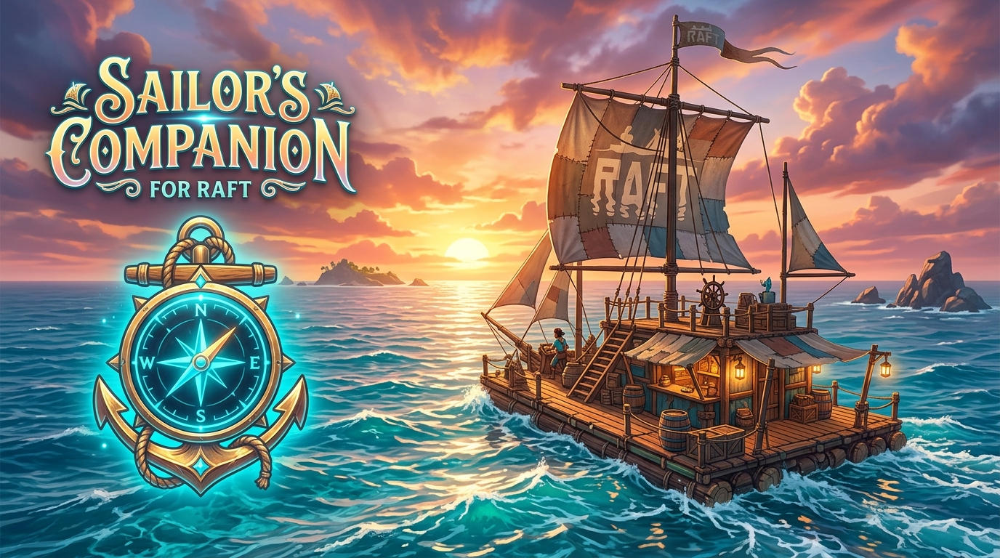

# ⚓ Sailor's Companion — Quality of Life & Survival Suite for Raft

[](https://github.com/RAVITEJAanand/SailorsCompanion-RaftMod/releases)
[-brightgreen.svg?style=for-the-badge&logo=steam)](https://store.steampowered.com/app/648800/Raft/)
[](https://discord.gg/B4EMrR5Vrf)
[](LICENSE)



**Sailor's Companion** is the definitive, all-in-one Quality of Life, Automation, Navigation, and Sandbox mod for **Raft (The Final Chapter)**. Built from the ground up with a native in-game wooden plank UI, rich HUD radar systems, intelligent raft recall teleportation, 3D island resource scanning, smart boat propulsion automation, and balanced survival progression.

---

## 🚀 What's New in Version 1.1.1

### 🛠️ Critical Bugfixes & Performance Enhancements
- **Fixed Collection Nets Despawning & Raft Sinking**: Resolved an issue where Collection Nets were detected as loose ocean debris, causing placed nets to vanish and destabilize raft physics when multiple nets were installed.
- **Fixed Dropped Items Auto-Pickup Loop**: Items dropped intentionally by the player (with `[Q]`) are no longer automatically sucked back into inventory.
- **⚡ 3.5x Fast Reef Mining**: Greatly accelerated Hook mining time for underwater Sand, Clay, Scrap, and Ores (~0.7s per node instead of 2.5s), keeping tool progression intact while removing tedious grind.
- **🦈 Temporary Shark Repel Ward**: Mining reef resources activates a 5-second protective aura that temporarily diverts Bruce the shark from attacking the player while underwater.
- **Collection Nets Safety Buffer**: Added automatic inventory capacity checks before emptying collection nets to avoid dropping overflow items into the sea.

---

## 🚀 What's New in Version 1.1.0

### ⛵ 1. Smart Boat Propulsion & Sail Control
- **Separated Engine & Sail Automation**: Toggle all engine wheels (`[Toggle All Engines]`) and unfurl/furl sails (`[Toggle All Sails]`) independently without disrupting each other.
- **Angle Preservation**: Non-destructive sail toggling that preserves your manual rudder angles and wheel directions.
- **Smart Sail Auto-Align Modes**:
  - `Manual`: Standard player-controlled sail angles.
  - `Auto-Align Wind`: Dynamically checks current ocean wind vectors and automatically rotates all sails to catch maximum tailwind for peak speed!
  - `Follow Raft Heading`: Aligns sails with the physical drift direction of your raft.

### 🔍 2. Item Detector & Island 3D Pulse Scanner
- **Island Pulse Scanner (`[Scan Island (10s)]`)**: Emits an expanding 3D sonar pulse (15m radius) around the player to locate ground loot, hidden chests, clay, scrap, metal/copper ores, and island flora.
- **Balanced Cooldowns**: 10s active duration with a 30s tactical cooldown in Survival Mode (instant ready in Creative Mode).
- **Subtle On-Screen Indicators**: Clean directional distance meters that guide you directly to resources without cluttering your screen.

### 🏝️ 3. Island Hand Pickup & Shallow Reef Underwater Harvesting
- **Island Land Hand Pickup**: Gather flowers, berries, fruit seeds, and loose ground loot with bare hands without equipping a hook.
- **Underwater Reef Harvesting**: Channel and mine Sand, Clay, Scrap, Metal Ore, and Copper Ore directly with your hands.
- **Rapid Reef Mining**: Optimized channeling time (0.4s extraction) allows quick reef diving before Bruce the shark can strike!

### 🧲 4. Magnetic Ocean Debris Auto-Collector
- **Ocean Magnet (`[Ocean Magnet (45s)]`)**: Generates an active 20m magnetic attraction field centered on the player or raft.
- **Smooth Physics Gliding**: Floats nearby barrels, crates, plastic, and planks directly to you with natural water buoyancy physics.
- **Survival Balanced**: 45s active suction with a 60s cooldown in Survival Mode (toggleable continuous in Creative Mode).

### ⌨️ 5. Optional Pro Quick Hotkeys (Anti-Conflict Design)
- **UI-First by Default**: All features can be triggered directly from the in-game wood menu without memorizing complex key combinations.
- **Optional Pro Hotkeys Toggle**: Enable `[Enable Quick Hotkeys]` in the Survival QoL tab to unlock instant gameplay keys:
  - `[F4]` — Toggle All Sails
  - `[F3]` — Toggle All Engines
  - `[F7]` — Toggle Ocean Magnet Field
  - `[F10]` — Trigger Island Pulse Scanner

---

## 🌟 Core Feature Suite

### 🟢 Dual Mode Architecture (Survival vs. Creative)
- **🟢 Survival Mode (Default)**: Authentic survival gameplay. All game-breaking cheats (God Mode, 1-Hit Kill, Free Instant Crafting, Fly/Noclip, Item Spawner) are strictly **LOCKED**. Recall to Raft `[F8]` has a balanced 3-minute emergency cooldown. Multipliers have safety-capped sliders with color-coded balance badges (`[🟢 Vanilla]`, `[🟢 Balanced OP]`, `[🟡 Easy Mode]`).
- **⚡ Creative Mode**: Total sandbox freedom. Instant 1-click recipe unlocking, item spawner with 300+ items, invulnerability, noclip flight, raft summoning, and custom weather controls.

### 🎮 Preset Profiles (1-Click Setup)
Switch optimized mod profiles instantly from the top row:
- **`🌿 Vanilla+`**: Authentic Raft survival balance (1.0x weapon dmg, Stack 40, normal speeds, craft-from-storage, creature health bars).
- **`⚖️ Balanced OP` (Recommended)**: The ultimate balance (1.5x weapon dmg, Stack 100, 1.5x crop growth, 1.5x hook reel, 1.2x swim/sprint, all automations enabled).
- **`⚡ Easy Mode`**: Casual gameplay (2.5x weapon dmg, Stack 200, 2.0x crop growth, 2.0x hook reel, 1.5x swim/sprint).
- **`⚙️ Custom`**: Fine-tune individual multipliers and toggles to your personal preference.

### ⚡ Intelligent Raft Teleportation & Recovery
- **Recall Player to Raft (`[F8]`)**: Teleport safely onto the raft deck from deep ocean waters or distant islands. Automatically finds a safe walkable deck tile, resets fall momentum, and parents your movement to the raft pivot (3-min cooldown in Survival).
- **Summon Raft to Player (`[F9]`)**: Calls your raft directly to your position on the water surface (~18m ahead) and automatically drops the anchor so it never drifts away (Creative/Emergency).
- **Remote Anchor Toggle**: Drop or raise the anchor remotely from anywhere in the world.

### 🧭 Real-Time Navigation HUD & Shark Radar
- **Compass Heading**: Cardinal directions (N, NE, E, SE, S, SW, W, NW) with exact 360° degrees.
- **Raft Distance & Drift Vector**: Directional arrow pointing toward your raft, distance in meters, speed in knots, and anchor status.
- **Bruce Shark Radar**: Live proximity tracker showing Bruce's distance with red alert warnings when he enters attack range (<25m).
- **Animal & Enemy Health Bars**: Floating overhead health bars and distance meters over creatures (automatically hides during loading).
- **4 Customizable HUD Styles (`[Shift + F6]` to cycle)**:
  1. *Sleek Ribbon* (Compact top-left status bar).
  2. *Top Compass Bar* (Skyrim/Subnautica style scrolling ribbon).
  3. *Minimalist Pill* (Clean single-line badge).
  4. *Classic Box* (Detailed telemetry dashboard).

### 🔬 Progressive Research Table & Blueprints
- **Survival Progressive Unlocks**:
  - *Base Research*: Learn standard recipes from Wood, Plastic, Metal, Scrap, Clay, and Sand.
  - *Chapter 1*: Radio Tower & Vasagatan story blueprints (Receiver, Antenna, Engine, Steering Wheel).
  - *Chapter 2*: Balboa Island, Caravan Town & Tangaroa (Biofuel, Machete, Zipline, Water Pipes).
  - *Chapter 3*: Varuna Point, Temperance & Utopia (Electric Smelter, Advanced Anchor, Titanium Tools).
- **Creative Sandbox Station**: 1-click **"Unlock All 100+ R&D Blueprints"**.

### 🦈 Raft & World Automations
- **Anti-Shark Raft Protection**: Prevents Bruce the Shark from ever biting or destroying your raft foundations.
- **Continuous Auto-Water Crops**: Keeps crop plots and livestock grass plots hydrated automatically.
- **Continuous Auto-Empty Nets**: Gathers flotsam trapped in collection nets directly into your inventory.
- **Craft from Nearby Storage**: Automatically pulls crafting materials from storage chests within 22m.
- **Infinite Tool Durability**: Hooks, weapons, equipment, and armor never degrade.
- **Weather & Time Controls**: Set time to Morning (08:00), Noon (12:00), or Night (22:00), and switch weather to Sunny, Calm, Rain, or Fog.

---

## ⌨️ Controls & Hotkeys Reference

| Key | Default Action | Notes |
|---|---|---|
| **`[F5]`** or **`[Insert]`** | **Open / Close Main Mod Menu** | Native 1.3x scaled wooden plank UI |
| **`[F6]`** | **Toggle Navigation HUD** | Shows/hides on-screen navigation bar |
| **`[Shift + F6]`** | **Cycle HUD Styles** | Ribbon ➔ Compass Bar ➔ Pill ➔ Classic Box |
| **`[F8]`** | **Recall Player to Raft** | Teleports safely onto raft deck (3m cooldown in Survival) |
| **`[F9]`** | **Summon Raft to Player** | Spawns raft ahead and drops anchor (Creative / Unlocked) |
| **`[F]`** | **Toggle Fly / Noclip** | WASD + Space/Shift flight (Creative Mode) |
| **`[ESC]`** | **Close Mod Menu** | Returns smoothly to active gameplay |

### ⌨️ Optional Pro Quick Hotkeys (When Enabled in Menu)
*Enable under `Survival QoL` ➔ `Advanced Pro Hotkeys` ➔ `[Enable Quick Hotkeys]`*

| Key | Action | Behavior |
|---|---|---|
| **`[F4]`** | **Toggle All Sails** | Unfurls or furls all sails without altering angles |
| **`[F3]`** | **Toggle All Engines** | Starts/stops all engine wheels simultaneously |
| **`[F7]`** | **Ocean Magnet Field** | Activates 20m debris suction (45s active / 60s cooldown) |
| **`[F10]`** | **Scan Island / Reef** | 10s 3D pulse detecting nearby loot, ores, and flora |

---

## 📥 Installation

### Method 1: BepInEx 5 (Recommended)
1. Install **[BepInEx 5 (x64)](https://github.com/BepInEx/BepInEx/releases)** into your Raft root directory (`steamapps/common/Raft`).
2. Download the latest `SailorsCompanion.dll` from the [Releases](https://github.com/RAVITEJAanand/SailorsCompanion-RaftMod/releases) page.
3. Place `SailorsCompanion.dll` into:
   ```
   steamapps/common/Raft/BepInEx/plugins/SailorsCompanion/
   ```
4. Launch Raft through Steam! Press **`[F5]`** to open the menu.

### Method 2: Raft Mod Loader (RML)
1. Install and launch the **Raft Mod Loader** (RML).
2. Place `SailorsCompanion.rmod` into your `steamapps/common/Raft/Mods/` directory.
3. Enable **Sailor's Companion** in the mod manager list and click **Play**.

---

## 👥 Multiplayer Compatibility
- **Client-Side Safe**: Navigation HUD, Radar, Teleport to Raft, Fly Mode, Tool Durability, and Item Spawner work seamlessly when joining multiplayer sessions.
- **Host Recommended**: World-altering features (Weather modification, Summon Raft, Anti-Shark Foundation Protection, Island Scanning) operate best when you are the host or playing singleplayer.

---

## 💬 Community & Support

Join the official **Konduri Modding Hub** community on Discord for support, updates, and sneak peeks!

[](https://discord.gg/B4EMrR5Vrf)

- 📢 **Latest Releases**: Instant notifications for mod updates and patches.
- 💡 **Feature Requests**: Suggest new mechanics or QoL features.
- 🐛 **Bug Reporting**: Direct troubleshooting and assistance.

---

## 📜 License
This project is open-source and released under the **[MIT License](LICENSE)**. Free for personal, non-commercial, and community gameplay.
